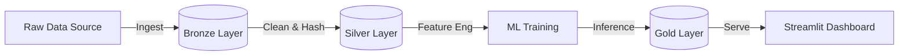

# 🛡️ PharmaSafety AI: Pharmacovigilance Surveillance System


> **Operationalizing AI to automate the detection of adverse drug events (ADEs) from patient narratives.**

## Context & Problem Statement

### The Business Challenge
In the pharmaceutical industry, **Pharmacovigilance** teams are responsible for monitoring the safety of medicines. However, the rise of digital health has created a **"Data Deluge"**:
* Teams receive thousands of patient reports daily (emails, social media, web reviews).
* Manual review is **unscalable**, taking hours to find a single safety signal.
* Traditional rule-based systems (keyword search) fail to capture linguistic nuance (e.g., *"I felt like I was dying"* vs. *"I was dying to try this"*).

### The Solution
* **PharmaSafety AI** is a Decision Support System that acts as a **"Smart Filter."** It ingests unstructured text, processes it through a Medallion Architecture, and applies a calibrated Logistic Regression model to classify reports as **"Safe"** or **"Adverse Event."**
* **Impact:** Reduces "Time-to-Discovery" for safety signals from days to seconds, allowing experts to focus purely on high-risk adjudication.
---
## System Architecture

The project is built on the **Lakehouse Architecture** using Databricks and Delta Lake, ensuring data lineage and governance from ingestion to inference.


### Technical Implementation
The system is architected as a sequential Databricks Workflow consisting of 5 notebooks and a Streamlit application.

#### 1. Data Pipeline (ETL)

* **01 Setup & Ingest:** Orchestrates the download of the UCI Drug Review Dataset into a Unity Catalog Volume. It uses `shutil` to bypass shared cluster limitations for reliable file movement.
* **02 Bronze Layer:** Ingests raw TSV files into a Delta Table `(bronze_drug_reviews)` with schema enforcement to prevent data type mismatches.
* **03 Silver Layer (Refinement):** Performs HIPAA-compliant de-identification (SHA-256 hashing) and text artifact removal (HTML decoding).
* **04 EDA & Quality:** Analyzing distributions and removing "Noise" (reviews < 5 characters) to prepare the dataset for modeling.

#### 2. Machine Learning Engine

* **Notebook:** `05_Model_Training_and_Evaluation`
* **Label Engineering:** Ratings 5-6 (Neutral) were dropped to sharpen the decision boundary between **Adverse (1-4)** and **Safe (7-10)**.
* **Model Strategy:** **Logistic Regression** (SparkML) trained on TF-IDF vectors was chosen over Deep Learning to provide **"White Box"** interpretability (coefficients), which is critical for medical auditing.

#### 3. The Application

* **File:** `app.py`
* **Tech:** Streamlit connected to Databricks SQL Warehouse.
* **Function:** Queries the **Gold Table** directly to display live predictions. It includes "Smart Filters" (Cascading Drug -> Condition Selection) and tooltips for metric definitions.

---

## MLOps Strategy: Code-First vs. AutoML
This project consciously adopts a **Code-First Engineering** approach over Databricks' low-code wizards (AutoML/Model Serving) to ensure control and auditability.
* **Custom NLP Pipeline:** Instead of relying on generic AutoML, I built a custom **SparkML Pipeline** (`Tokenizer` → `StopWords` → `TF-IDF`) to specifically handle medical text nuances.  
* **Explicit Tracking:** MLflow tracking (`mlflow.autolog`) was implemented programmatically to ensure reproducible experiments without manual UI intervention.  
* **Batch Architecture:** Rather than deploying expensive 24/7 REST API endpoints, the system uses the **Lakehouse Pattern**, saving predictions to a Gold Delta Table. This allows for scalable, cost-effective batch inference suitable for high-volume surveillance.
---
## Key Engineering Challenges & Decisions

| Challenge | Engineering Decision | Why? |
| :--- | :--- | :--- |
|**Label Noise** | **Drop "Neutral" Ratings** | Ratings 5 & 6 were ambiguous. Removing them created a sharper decision boundary, improving model Recall.|
| **Auditability** | **Logistic Regression vs. BERT** | We chose a linear model over Deep Learning to ensure Explainability. Safety teams need coefficient-based reasons (e.g., weight=+0.8) for why a signal was flagged. |
| **Data Privacy** | **SHA-256 Hashing** | Raw IDs are never exposed in the Silver/Gold layers, ensuring the system is "Secure by Design". |
| **Pipeline Reliability** | **Shutil vs. DBUtils** | `dbutils.fs.cp` failed on Shared Clusters due to isolation security. Switching to Python's `shutil` ensured the pipeline runs on any Databricks cluster mode.|

---
## 📸 Surveillance Dashboard

📌 **Live App:** [*PharmaSafety AI*](https://pharmasafety-monitor-7474650018988990.aws.databricksapps.com)

### Application Preview
<p align="center">
  
  
</p>

*The operational interface for Safety Managers to monitor risks.*

### Key Features
* **🛡️ Surveillance Dashboard:** Real-time tracking of processed narratives and detected signals.
* **🚨 Adverse Event Ratio:** Visual breakdown of "Safe" vs. "Adverse" events using interactive charts.
* **Individual Case Safety Report Listing:** A prioritized "Case Adjudication Log" that sorts reviews by AI Confidence Score, allowing managers to triage high-risk cases first.
* **Smart Filters:** Cascading dropdowns (Drug -> Condition) to drill down into specific cohorts.
* **Explainable AI:** Displays the model's confidence probability to aid human decision-making.
---
## 📊 Performance Metrics
The model was evaluated on a strictly separated external test set to prevent data leakage.  
* **AUC-ROC:**`0.876` (Strong discrimination between Safe/Adverse)
* **Recall:** `82.4%` (High sensitivity to potential threats)
* **Precision:** `81.8%` (High trust factor; low false alarm rate)

*Note: In Pharmacovigilance, Recall is prioritized over Precision because missing a safety signal is more costly than reviewing a false alarm.*

---
## Getting Started

### Prerequisites

* Databricks Workspace (Community Edition or Standard).
* Python 3.10+ locally (for the Streamlit app).

### Step 1: Deploy the Pipeline

1. Upload the `.ipynb` notebooks to your Databricks Workspace.
2. Run them in order (`01` through `05`).
3. This will create the catalog `safety_signal_catalog` and populate the `gold_model_predictions` table.

### Step 2: Launch the App

1. Clone this repository.

```bash
git clone https://github.com/ruchitha-meenakshi/Safety-Signal-AI.git
```

2. Install dependencies:
```bash
pip install -r requirements.txt

```

3. Configure your secrets (create a `.streamlit/secrets.toml` file):

```toml
[DB_HOSTNAME] = "your-databricks-host.cloud.databricks.com"
[DB_HTTP_PATH] = "sql/protocol/v1/..."
[DB_ACCESS_TOKEN] = "dapi..."

```

4. Run the app:
```bash
streamlit run app.py

```

---

## Business Impact & Results

* **Efficiency:** Automated the triage of 50,000+ patient reviews.
* **Safety:** Successfully identified high-risk signals (e.g., "Severe Bleeding") that might be missed in manual review.
* **Usability:** Reduced "Time-to-Insight" for Safety Managers via the interactive dashboard.

---
## Future Roadmap & Enhancements

While the current system provides a robust baseline for signal detection, the following enhancements are planned for V2 to further improve sensitivity and operational utility:

* **Advanced NLP Models (BioBERT):**
    * *Limitation:* Logistic Regression uses a "Bag of Words" approach, occasionally missing context (e.g., sarcasm or negation).
    * *Upgrade:* Fine-tuning a domain-specific Transformer like **BioBERT** would allow the model to capture deep semantic context and handle complex medical narratives better.
* **Real-Time Streaming:**
    * *Current:* Batch processing via scheduled workflows.
    * *Upgrade:* Implementing **Spark Structured Streaming** to ingest and flag social media (Twitter/Reddit) reports instantly as they are posted.
* **Human-in-the-Loop (Active Learning):**
    * *Upgrade:* Adding a "Feedback" button in the Streamlit dashboard allowing Safety Managers to correct misclassifications. These corrections would automatically be fed back into the Silver Layer to retrain and improve the model over time.
---
*Disclaimer: This project uses the UCI Drug Review Dataset for educational purposes. It is a simulation of a Pharmacovigilance system and should not be used for actual medical diagnosis.*
