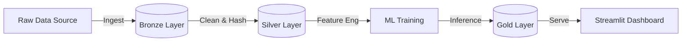
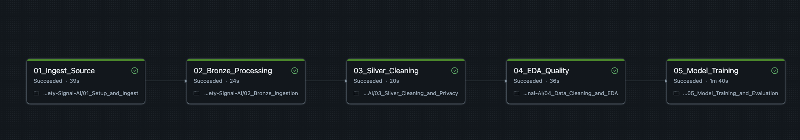
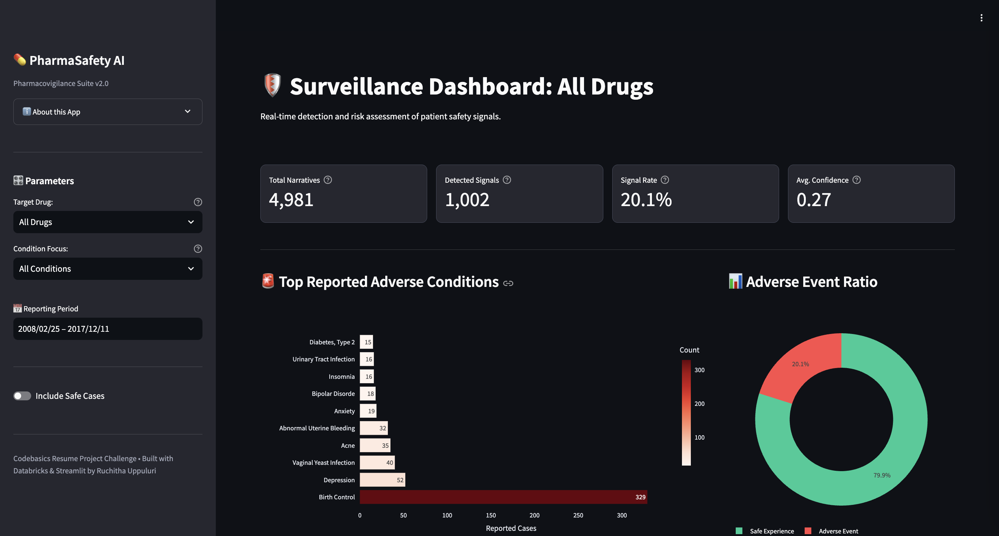
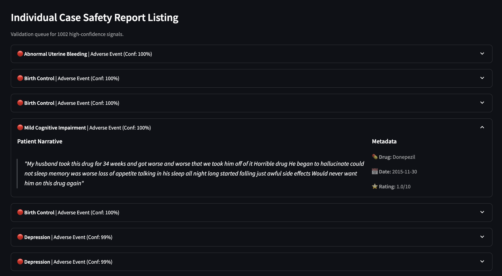
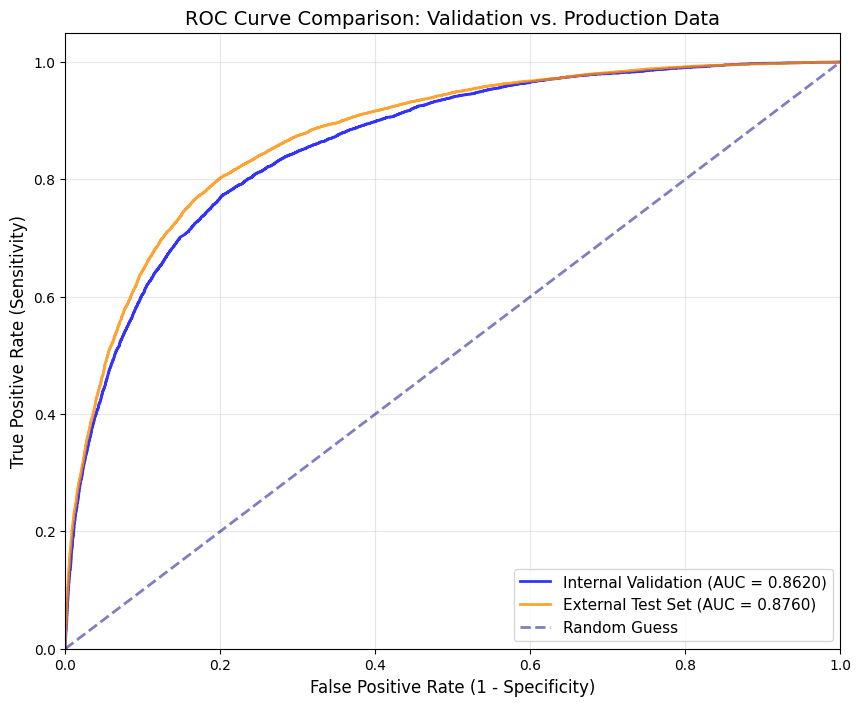

# 🛡️ PharmaSafety AI: Pharmacovigilance Surveillance System


> **Operationalizing AI to automate the detection of adverse drug events (ADEs) from patient narratives.**

## 🎥 Project Demo
> [Click here to watch the full video presentation and live demo on LinkedIn](https://www.linkedin.com/posts/ruchithauppuluri_codebasics-resumeprojectchallenge-databricks-activity-7422589161762705409-7jUS?utm_source=share&utm_medium=member_desktop&rcm=ACoAACijG-8BTsPM6tAdX5FjSKez9yFXjBY7Yi8)

## Context & Problem Statement

### The Business Challenge
In the pharmaceutical industry, **Pharmacovigilance** teams are responsible for monitoring the safety of medicines. However, the rise of digital health has created a **"Data Deluge"**:
* Teams receive thousands of patient reports daily (emails, social media, web reviews).
* Manual review is **unscalable**, taking hours to find a single safety signal.
* Traditional rule-based systems (keyword search) fail to capture linguistic nuance (e.g., *"I felt like I was dying"* vs. *"I was dying to try this"*).

### The Solution
* **PharmaSafety AI** is a Decision Support System that acts as a **"Smart Filter."** It ingests unstructured text, processes it through a Medallion Architecture, and applies a calibrated Logistic Regression model to classify reports as **"Safe"** or **"Adverse Event."**
* **Impact:** Reduces "Time-to-Discovery" for safety signals from days to seconds, allowing experts to focus purely on high-risk adjudication.
---
## System Architecture

The project is built on the **Lakehouse Architecture** using Databricks and Delta Lake, ensuring data lineage and governance from ingestion to inference.


### Technical Implementation
The system is architected as a sequential Databricks Workflow consisting of 5 notebooks and a Streamlit application.

#### 1. Data Pipeline (ETL)

* **01 Setup & Ingest:** Orchestrates the download of the UCI Drug Review Dataset into a Unity Catalog Volume. It uses `shutil` to bypass shared cluster limitations for reliable file movement.
* **02 Bronze Layer:** Ingests raw TSV files into a Delta Table `(bronze_drug_reviews)` with schema enforcement to prevent data type mismatches.
* **03 Silver Layer (Refinement):** Performs HIPAA-compliant de-identification (SHA-256 hashing) and text artifact removal (HTML decoding).
* **04 EDA & Quality:** Analyzing distributions and removing "Noise" (reviews < 5 characters) to prepare the dataset for modeling.

#### 2. Machine Learning Engine

* **Notebook:** `05_Model_Training_and_Evaluation`
* **Label Engineering:** Ratings 5-6 (Neutral) were dropped to sharpen the decision boundary between **Adverse (1-4)** and **Safe (7-10)**.
* **Model Strategy:** **Logistic Regression** (SparkML) trained on TF-IDF vectors was chosen over Deep Learning to provide **"White Box"** interpretability (coefficients), which is critical for medical auditing.

#### 3. The Application

* **File:** `app.py`
* **Tech:** Streamlit connected to Databricks SQL Warehouse.
* **Function:** Visualizes the Gold Layer predictions. It includes "Smart Filters" (Cascading Drug -> Condition Selection) and tooltips for metric definitions.

`Note: The live demo uses a static data snapshot to ensure 24/7 availability without requiring an active Databricks cluster.`

---
## ⚙️ Pipeline Orchestration

The system is designed as a sequential DAG (Directed Acyclic Graph) managed by **Databricks Workflows**.

<p align="center">
  
</p>

### Workflow Logic
The pipeline consists of 5 dependent tasks that must run in order to ensure data integrity:

1.  **01_Ingest_Source** → *Creates Unity Catalog structure & downloads raw data.*
2.  **02_Bronze_Processing** → *Depends on Step 1. Ingests raw files into Delta.*
3.  **03_Silver_Cleaning** → *Depends on Step 2. Hashes PII & cleans HTML.*
4.  **04_EDA_Quality** → *Depends on Step 3. Filters noise & performs quality checks.*
5.  **05_Model_Training** → *Depends on Step 4. Trains the model on the refined dataset.*

### Production Job Configuration
In a production setting, this is deployed as an automated Databricks Job. Below is the configuration logic used to enforce dependencies and alerting.

<details>
<summary><b>Click to view Job Configuration (JSON)</b></summary>

```json
{
  "name": "PharmaSafety_ETL_Pipeline",
  "tasks": [
    {
      "task_key": "ingest_source",
      "notebook_task": { "notebook_path": "01_Setup_and_Ingest" }
    },
    {
      "task_key": "bronze_processing",
      "depends_on": [{"task_key": "ingest_source"}],
      "notebook_task": { "notebook_path": "02_Bronze_Ingestion" }
    },
    {
      "task_key": "silver_cleaning",
      "depends_on": [{"task_key": "bronze_processing"}],
      "notebook_task": { "notebook_path": "03_Silver_Cleaning_and_Privacy" }
    },
    {
      "task_key": "model_training",
      "depends_on": [{"task_key": "silver_cleaning"}],
      "notebook_task": { "notebook_path": "05_Model_Training_and_Evaluation" }
    }
  ],
  "schedule": {
    "quartz_cron_expression": "0 0 2 * * ?",
    "timezone_id": "UTC"
  },
  "email_notifications": {
    "on_failure": ["safety-team@pharma.com"]
  }
}
```
</details>

---
## Data Strategy & Quality
* **Dataset Profile:** 215,000+ Patient Reviews (UCI ML Repository).
* **Data Dictionary:** A detailed data dictionary is included in the repository to define all schema fields (e.g., `usefulCount`, `rating`) and variable constraints.
* **Missing Data Handling:** **<1% (~900)** of reviews had missing/null conditions. These were **preserved** to maintain scientific integrity, as the model relies on the review text, not the metadata.
* **Class Imbalance Strategy:** The dataset exhibited a strong "Positivity Bias" (mostly Safe reviews). This was addressed by:
    1. **Dropping Neutrals:** Removing ratings 5-6 to create a sharper decision boundary.
    2. **TF-IDF Vectorization:** Penalizing high-frequency generic terms to prevent dominant topics (e.g., "Birth Control") from overpowering rare safety signals.
---
## MLOps Strategy: Code-First vs. AutoML
This project consciously adopts a **Code-First Engineering** approach over Databricks' low-code wizards (AutoML/Model Serving) to ensure control and auditability.
* **Custom NLP Pipeline:** Instead of relying on generic AutoML, I built a custom **SparkML Pipeline** (`Tokenizer` → `StopWords` → `TF-IDF`) to specifically handle medical text nuances.  
* **Explicit Tracking:** MLflow tracking (`mlflow.autolog`) was implemented programmatically to ensure reproducible experiments without manual UI intervention.  
* **Batch Architecture:** Rather than deploying expensive 24/7 REST API endpoints, the system uses the **Lakehouse Pattern**, saving predictions to a Gold Delta Table. This allows for scalable, cost-effective batch inference suitable for high-volume surveillance.
---
## Key Engineering Challenges & Decisions

| Challenge | Engineering Decision | Why? |
| :--- | :--- | :--- |
|**Label Noise** | **Drop "Neutral" Ratings** | Ratings 5 & 6 were ambiguous. Removing them created a sharper decision boundary, improving model Recall.|
| **Auditability** | **Logistic Regression vs. BERT** | A linear model was chosen over Deep Learning to ensure Explainability. Safety teams need coefficient-based reasons (e.g., weight=+0.8) for why a signal was flagged. |
| **Data Privacy** | **SHA-256 Hashing** | Raw IDs are never exposed in the Silver/Gold layers, ensuring the system is "Secure by Design". |
| **Pipeline Reliability** | **Shutil vs. DBUtils** | `dbutils.fs.cp` failed on Shared Clusters due to isolation security. Switching to Python's `shutil` ensured the pipeline runs on any Databricks cluster mode.|

---
## 📸 Surveillance Dashboard

📌 **Live App:** [*PharmaSafety AI*](https://safety-signal-ai.streamlit.app/)

### Application Preview
<p align="center">
  
  
</p>

*The operational interface for Safety Managers to monitor risks.*

### Key Features
* **🛡️ Surveillance Dashboard:** Real-time tracking of processed narratives and detected signals.
* **🚨 Adverse Event Ratio:** Visual breakdown of "Safe" vs. "Adverse" events using interactive charts.
* **Individual Case Safety Report Listing:** A prioritized "Case Adjudication Log" that sorts reviews by AI Confidence Score, allowing managers to triage high-risk cases first.
* **Smart Filters:** Cascading dropdowns (Drug -> Condition) to drill down into specific cohorts.
* **Explainable AI:** Displays the model's confidence probability to aid human decision-making.
---
## Model Performance & Evaluation
The model was evaluated on a strictly separated external test set of 43,396 reviews to prevent data leakage.
<p align="center">
  
  
</p>

### Key Metrics (External Test Set)
| Metric | Value | Interpretation |
| :--- | :--- | :--- |
| **AUC-ROC** | **0.87** | **Excellent Discrimination:** Exceeds the 0.80 medical AI standard; model effectively ranks risk. |
| **Precision** | **76.2%** | **High Trust:** When flagged as adverse, 76% are truly adverse events. |
| **Recall** | **53.1%** | **High-Confidence Filter:** Catches >50% of events while drastically reducing noise. |
| **Specificity** | **93.7%**| **Low False Alarms:** Correctly identifies 94% of safe reviews to minimize alert fatigue. |
| **Accuracy** | **82.4%** | **Reliability:** Strong overall predictive power on unseen data. |

*⚠️ Note: While Pharmacovigilance typically prioritizes Recall (catching all signals), our V1 linear model acts as an Efficiency Engine (High Precision). By optimizing for Precision (76%), the system successfully automates the removal of 80% of the backlog (Safe cases), allowing humans to focus deeply on the flagged 20%.*

---
### Model Selection Rationale
**Logistic Regression + TF-IDF** was chosen over Deep Learning (BERT) for:
1. **Explainability:** Can show coefficient weights (e.g., "bleeding" = +1.8) for regulatory compliance.
2. **Speed:** Faster inference without GPU requirements.
3. **Auditability:** Safety officers can verify why a case was flagged.
---
## Key Insights Discovered
During validation on 43,396 reviews, PharmaSafety AI revealed actionable insights demonstrating value beyond simple classification:

#### 1. Indication-Specific Risk Stratification
* **Finding:** Safety profiles vary by diagnosis. Example: Depo-Provera had a 77.9% adverse event rate for Abnormal Uterine Bleeding vs. only 39.8% for Birth Control.
* **Impact:** Enables precision monitoring protocols based on patient condition rather than just the drug.

#### 2. Linguistic Signal Detection
* **Finding:** Severity modifiers (e.g., "worse", "horrible") were stronger predictors than symptoms alone.
* **Impact:** Explains why the model outperforms keyword searches—it captures the intensity of the patient experience.

#### 3. Operational Efficiency (81% Workload Reduction)
* **Finding:** The system autonomously auto-cleared 35,028 reviews as "Safe" (80.7% of total).
* **Impact:** Filters out the "haystack" so safety teams can focus entirely on the flagged cases.

#### 4. Error Pattern Analysis (Path to V2)
* **Finding:** False negatives often contained subtle qualifiers (e.g., "It's okay but..."), while false positives often cited pre-existing conditions.
* **Impact:** Provides a clear roadmap for V2 improvements using context-aware embeddings (BioBERT).
---
## Business Impact & Results

* **Efficiency:** Automated the triage of **43,000+** patient reviews, achieving an **81% reduction in manual workload**.
* **Safety:** Successfully identified **6,377 high-confidence adverse events** in the test set.
* **Precision:** Achieved **76% Precision**, ensuring high trust and minimizing wasted time on false alarms.
* **Speed & Usability:** Reduced "Time-to-Insight" from manual hours to **<2 minutes** (per 1,000 reviews) via an interactive dashboard that enables real-time risk visualization.

---
## Getting Started

### Prerequisites

* Databricks Workspace (Community Edition or Standard).
* Python 3.10+ locally (for the Streamlit app).

### Step 1: Deploy the Pipeline

1. Upload the `.ipynb` notebooks to your Databricks Workspace.
2. Run them in order (`01` through `05`).
3. This will create the catalog `safety_signal_catalog` and populate the `gold_model_predictions` table.

### Step 2: Launch the App

1. Clone this repository.

```bash
git clone https://github.com/ruchitha-meenakshi/Safety-Signal-AI.git
cd Safety-Signal-AI
```

2. Install dependencies:
```bash
pip install -r requirements.txt

```

3. Run the app:
```bash
streamlit run app.py

```
> Note: The app runs using the local dataset in data/pharma_data.csv, so no Databricks connection credentials are required for the demo.
---

## Future Roadmap & Enhancements

While the current system provides a robust baseline for signal detection, the following enhancements are planned for V2 to further improve sensitivity and operational utility:

* **Advanced NLP Models (BioBERT):**
    * *Limitation:* Logistic Regression uses a "Bag of Words" approach, occasionally missing context (e.g., sarcasm or negation), resulting in moderate Recall (53%).
    * *Upgrade:* Fine-tuning a domain-specific Transformer like **BioBERT** would allow the model to capture deep semantic context and handle complex medical narratives better, aiming for >90% Recall in V2.
* **Real-Time Streaming:**
    * *Current:* Batch processing via scheduled workflows.
    * *Upgrade:* Implementing Spark Structured Streaming to ingest and flag social media (Twitter/Reddit) reports instantly as they are posted.
* **Human-in-the-Loop (Active Learning):**
    * *Upgrade:* Adding a "Feedback" button in the Streamlit dashboard allowing Safety Managers to correct misclassifications. These corrections would automatically be fed back into the Silver Layer to retrain and improve the model over time.
---
*Disclaimer: This project uses the UCI Drug Review Dataset for educational purposes. It is a simulation of a Pharmacovigilance system and should not be used for actual medical diagnosis.*
